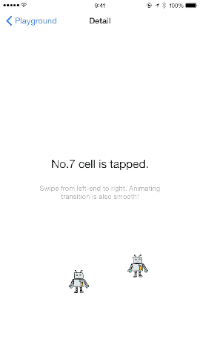

# 

[](http://cocoadocs.org/docsets/TouchVisualizer) [](http://cocoadocs.org/docsets/TouchVisualizer) [](http://cocoadocs.org/docsets/TouchVisualizer)
[](https://github.com/morizotter/TouchVisualizer)
[](https://circleci.com/gh/morizotter/TouchVisualizer/tree/master) [](https://gitter.im/morizotter/TouchVisualizer?utm_source=badge&utm_medium=badge&utm_campaign=pr-badge&utm_content=badge)

TouchVisualizer is a lightweight pure Swift implementation for visualising touches on the screen.

##Features
- Works with just **a single line of code**!
- Supports multiple fingers.
- Supports multiple `UIWindow`'s.
- Displays touch radius (finger size).
- Displays touch duration.
- Customise the finger-points image and colour.
- Supports iPhone and iPad in both portrait and landscape mode.

##How it looks
###Portrait:

###Landscape:

###Robots:

###In-app implementation:


It's fun!

##Runtime Requirements

- iOS8.1 or later
- Xcode 6.3

## Installation and Setup
**Note:** Embedded frameworks require a minimum deployment target of iOS 8.1.

**Information:** To use TouchVisualizer with a project targeting iOS 8.0 or lower, you must include the `TouchVisualizer.swift` source file directly in your project.

###Installing with CocoaPods

[CocoaPods](http://cocoapods.org) is a centralised dependency manager that automates the process of adding libraries to your Cocoa application. You can install it with the following command:

```bash
$ gem update
$ gem install cocoapods
$ pods --version
```

To integrate TouchVisualizer into your Xcode project using CocoaPods, specify it in your `Podfile` and run `pod install`.

```bash
platform :ios, '8.1'
use_frameworks!
pod "TouchVisualizer", '~>1.2'
```

###Installing with Carthage
Carthage is a decentralised dependency manager that automates the process of adding frameworks to your Cocoa application.

You can install Carthage with [Homebrew](http://brew.sh/) using the following command:

```bash
$ brew update
$ brew install carthage
```

To integrate TouchVisualizer into your Xcode project using Carthage, specify it in your `Cartfile`:

```ogdl
github "morizotter/TouchVisualizer" "1.2.1"
```

###Manual Installation

To install TouchVisualizer without a dependency manager, please add all of the files in `/Pod` to your Xcode Project.

##Usage

To start using TouchVisualizer, write the following line wherever you want to start visualising:

```swift
import TouchVisualizer
```

Then invoke visualisation, by calling:

```swift
Visualizer.start()
```

and stop the presentation like this:

```swift
Visualizer.stop()
```

It is really simple, isn't it?

##Customisation

TouchVisualizer also has the ability to customise your touch events. Here is an example of what can be customised:

```swift
var config = Configuration()
config.color = UIColor.redColor()
config.image = UIImage(named: "YOUR-IMAGE")
config.showsTimer = true
config.showsTouchRadius = true
config.showsLog = true
Visualizer.start(config)
```

###Configuration properties

|name|type|description|default|
|:----|:----|:----|:----|
| color | `UIColor` | Color of touch point and text. | default color |
| image | `UIImage` | Touch point image. If rendering mode is set to  `UIImageRenderingModeAlwaysTemplate`, the image is filled with color above. | circle image |
| defaultSize| `CGize` | Default size of touch point.| 60 x 60px |
| showsTimer| `Bool` | Shows touch duration. | false |
| showsTouchRadius | `Bool` | Shows touch radius by scalling touch point. It doesn't work on simulator. | false |
| showsLog | `Bool` | Shows log. | false |

##Documentation
###Peripheral

- [How to take an iOS screen movie](misc/take_a_movie.md)

###Presentation

- [TouchVisualizer Demo movie #potatotips // Speaker Deck](https://speakerdeck.com/morizotter/touchvisualizer-demo-movie-number-potatotips) @potatotips May 13 2015

##Contributing

Please file issues or submit pull requests for anything you’d like to see! We're waiting! :)

##Licensing
TouchVisualizer is released under the MIT license. Go read the LICENSE file for more information.
####Miscellaneous
There is a similar *touch visualisation* library called [COSTouchVisualizer](https://github.com/conopsys/COSTouchVisualizer), which is written in Objective-C. [COSTouchVisualizer](https://github.com/conopsys/COSTouchVisualizer) supports earlier versions of iOS and is more mature. If TouchVisualizer isn't enough for you, try that!
